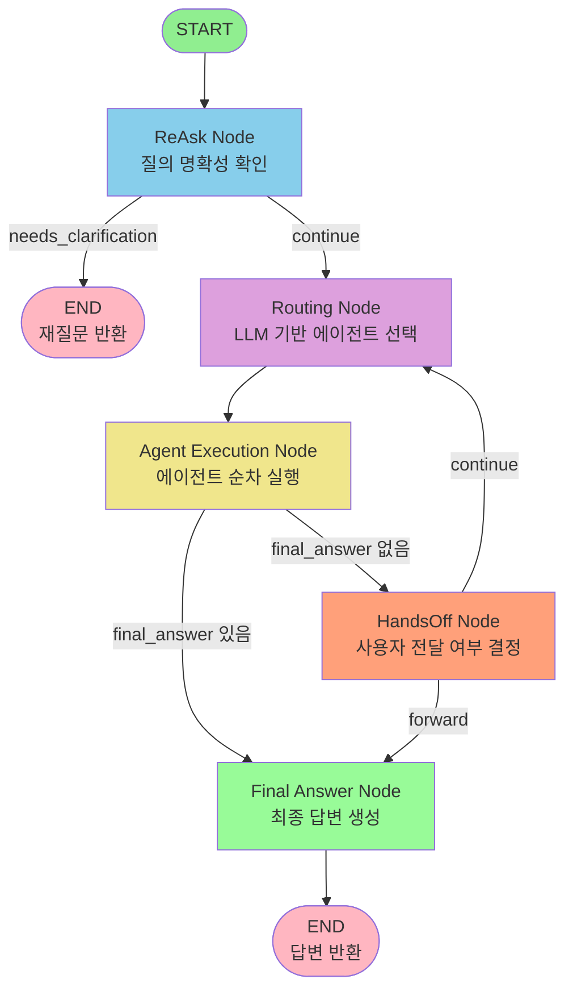

# FX Hedge Agent Project

환율 헷지 전략을 위한 멀티 에이전트 시스템 (Multi-Agent System for FX Hedge Strategy)

## 📋 목차

- [개요](#개요)
- [주요 기능](#주요-기능)
- [프로젝트 구조](#프로젝트-구조)
- [기술 스택](#기술-스택)
- [설치 및 설정](#설치-및-설정)
- [사용 방법](#사용-방법)
- [아키텍처](#아키텍처)
- [API 문서](#api-문서)
- [개발 가이드](#개발-가이드)
- [라이선스](#라이선스)

## 🎯 개요

FX Hedge Agent는 LangChain과 LangGraph를 활용한 멀티 에이전트 시스템으로, 환율 헷지 전략 수립을 위한 정보 수집, 분석, 의사결정을 자동화합니다. Supervisor 에이전트가 여러 전문 에이전트들을 오케스트레이션하여 사용자의 질의에 대한 종합적인 답변을 제공합니다.

### 핵심 특징

- 🤖 **멀티 에이전트 시스템**: Supervisor가 여러 전문 에이전트를 조율
- 🔍 **다양한 정보 소스**: RDB, VDB, 웹 검색을 통한 정보 수집
- 🧠 **LLM 기반 분석**: GPT 모델을 활용한 자연어 처리 및 분석
- 📊 **LangSmith 추적**: 모든 LLM 호출의 자동 추적 및 모니터링
- 🔧 **모듈화된 구조**: 확장 가능하고 유지보수가 용이한 아키텍처

## ✨ 주요 기능

### 1. 멀티 에이전트 오케스트레이션
- **Supervisor**: LangGraph 기반 전체 워크플로우 관리 및 라우팅
- **Market Information Agent**: 시장 정보 수집 및 분석 (RDB, 웹 검색 활용)
- **Expert Information Agent**: RAG 기반 전문가 문서 검색 및 요약 (Qdrant VDB 활용)
- **User Information Agent**: 사용자 프로필 및 자산 정보 관리 (MariaDB user_info 테이블)
- **Strategy Execute Agent**: 환헷지 전략 실행 및 최적 헷지 비중 계산
- **ReAsk Agent**: 불명확한 질의에 대한 재질문
- **ReAct Agent**: Reasoning과 Acting을 통한 문제 해결
- **HandsOff Agent**: 사용자에게 직접 전달

### 2. 도구 (Tools)
- **RDB Tools**: MariaDB를 통한 환율 데이터 조회 및 수정
  - 하드코딩된 쿼리 실행 (`rdb_query_hard`)
  - LLM 기반 동적 쿼리 생성 (`rdb_query_llm`)
  - 사용자 정보 조회/수정 (`user_info_get`, `user_info_upsert`)
  - 자산 로그 조회 (`user_asset_log_get`)
- **VDB Tools**: Qdrant 벡터 DB를 통한 유사 문서 검색 (`vdb_search`)
- **Web Search**: Google Custom Search API를 통한 최신 정보 수집
- **Calculator**: 환헷지 계산 도구 (최적 헷지 비중, 변동성, 상관계수 등)
- **Date Parser**: 자연어 날짜 파싱
- **News Search**: 외환 뉴스 검색 (ForexNewsAPI)
- **News Sentimental Analysis**: 뉴스 센티멘트 분석

### 3. 상태 관리
- 세션별 상태 관리 (`StateManager`)
- 대화 히스토리 추적
- 참조(Reference) 및 액션(Action) 기록
- LangGraph Checkpoint를 통한 상태 영속성

## 📁 프로젝트 구조

```
FX-Hedge-Agent-Project/
├── src/                          # 메인 소스 코드
│   ├── agents/                   # 에이전트 구현
│   │   ├── market_information_agent.py    # 시장 정보 수집 및 분석
│   │   ├── expert_information_agent.py    # RAG 기반 전문가 문서 검색
│   │   ├── user_information_agent.py      # 사용자 정보 관리
│   │   ├── strategy_execute_agent.py      # 환헷지 전략 실행
│   │   ├── react_agent.py                 # Reasoning & Acting
│   │   ├── reask_agent.py                 # 질의 명확성 확인
│   │   ├── handsoff_agent.py             # 사용자 직접 전달
│   │   └── supervisor/                   # Supervisor 에이전트
│   │       └── supervisor.py             # LangGraph 기반 오케스트레이터
│   ├── tools/                    # 도구 구현
│   │   ├── rdb.py                        # MariaDB 쿼리 도구
│   │   ├── vdb.py                        # Qdrant 벡터 DB 검색
│   │   ├── web_search.py                 # Google Custom Search
│   │   ├── calculator.py                 # 환헷지 계산 도구
│   │   ├── date_parser.py                # 날짜 파싱
│   │   ├── news_search.py                # 외환 뉴스 검색
│   │   └── news_sentimental_analysis.py  # 뉴스 센티멘트 분석
│   ├── utils/                    # 유틸리티 모듈
│   │   ├── llm.py                        # LLM 관련 (LangChain, OpenAI, LangSmith)
│   │   ├── tools.py                      # Tool 관련 (에러 처리, 스키마, decorator)
│   │   ├── agents.py                     # BaseAgent 클래스
│   │   ├── state.py                      # State 관리
│   │   ├── logger.py                     # 로깅
│   │   ├── settings.py                   # 설정 관리
│   │   ├── middleware.py                 # FastAPI 미들웨어
│   │   ├── hedge_db.py                   # 헷지 DB 유틸리티
│   │   ├── runnable_helpers.py           # LangChain Runnable 헬퍼
│   │   └── tool_helpers.py               # Tool 헬퍼 함수
│   ├── prompts/                  # 프롬프트 정의
│   │   ├── supervisor_routing.py         # Supervisor 라우팅 프롬프트
│   │   ├── supervisor_instruction.py     # Supervisor 지시 프롬프트
│   │   ├── market_information_instruction.py
│   │   ├── market_information_routing.py
│   │   ├── expert_information_instruction.py
│   │   ├── expert_information_routing.py
│   │   ├── user_information_instruction.py
│   │   ├── user_information_routing.py
│   │   └── strategy_execute_routing.py
│   └── query/                    # SQL 쿼리 정의
│       ├── rdb_hard_queries.py            # 하드코딩된 쿼리
│       └── rdb_modify_queries.py         # 수정 쿼리
├── api/                          # FastAPI 애플리케이션
│   └── main.py                           # FastAPI 메인 앱
├── frontend/                     # 프론트엔드 (React 등)
│   ├── src/
│   │   ├── components/           # React 컴포넌트
│   │   ├── pages/                # 페이지 컴포넌트
│   │   ├── services/             # API 서비스
│   │   ├── hooks/                # React Hooks
│   │   ├── utils/                # 유틸리티
│   │   └── styles/               # 스타일
│   └── public/
├── notebook/                     # 실험 및 노트북
│   ├── minseok/                  # 강민석 실험 노트북
│   ├── chaewon/                  # 채원 실험 노트북
│   └── yonju/                    # 연주 실험 노트북
├── scripts/                      # 유틸리티 스크립트
│   ├── ecos.py                   # ECOS 데이터 수집
│   ├── fred.py                   # FRED 데이터 수집
│   ├── ingest_docs.py            # 문서 수집
│   ├── update_asset.py           # 자산 업데이트
│   ├── user_info.py              # 사용자 정보 스크립트
│   └── yf_spy.py                 # Yahoo Finance SPY 데이터
├── data/                         # 데이터 파일
│   ├── ecos.csv                  # ECOS 데이터
│   └── series_specs.csv          # 시리즈 스펙
├── config.json                   # 설정 파일 (환경 변수 템플릿)
├── docker-compose.yml            # Docker Compose 설정
├── Dockerfile                    # Docker 이미지 빌드 파일
├── requirements.txt              # Python 의존성
└── README.md                     # 이 파일
```

## 🛠 기술 스택

### 핵심 프레임워크
- **LangChain**: LLM 애플리케이션 개발 프레임워크
- **LangGraph**: 상태 기반 멀티 에이전트 오케스트레이션
- **FastAPI**: 고성능 웹 API 프레임워크
- **Pydantic**: 데이터 검증 및 설정 관리

### LLM & 추적
- **OpenAI GPT**: 자연어 처리 및 분석
- **LangSmith**: LLM 호출 추적 및 모니터링

### 데이터베이스
- **MariaDB**: 관계형 데이터베이스 (환율 데이터)
- **Qdrant**: 벡터 데이터베이스 (유사 문서 검색)

### 데이터 처리
- **pandas**: 데이터 분석 및 처리
- **numpy**: 수치 계산
- **tiktoken**: 토큰 카운팅

### 문서 처리
- **PyMuPDF (fitz)**: PDF 처리
- **trafilatura**: 웹 페이지 텍스트 추출
- **beautifulsoup4**: HTML 파싱

### 기타
- **Python 3.8+**: 메인 프로그래밍 언어
- **pymysql**: MariaDB 연결
- **qdrant-client**: Qdrant 클라이언트
- **requests**: HTTP 요청
- **python-dotenv**: 환경 변수 관리

## 🚀 설치 및 설정

### 1. 저장소 클론

```bash
git clone <repository-url>
cd FX-Hedge-Agent-Project
```

### 2. Python 가상 환경 생성 및 활성화

```bash
python -m venv venv
source venv/bin/activate  # Linux/Mac
# 또는
venv\Scripts\activate  # Windows
```

### 3. 의존성 설치

```bash
pip install -r requirements.txt
```

### 4. 환경 변수 설정

`.env` 파일을 생성하거나 환경 변수를 설정합니다:

```bash
# OpenAI
export OPENAI_API_KEY="your-openai-api-key"
export OPENAI_MODEL="gpt-4"  # 기본값: gpt-4.1

# 데이터베이스
export DB_HOST="localhost"
export DB_PORT="3306"
export DB_USER="your-db-user"
export DB_PASSWORD="your-db-password"
export DB_NAME="fx_hedge"

# Qdrant
export QDRANT_URL="http://localhost:6333"  # 또는
export QDRANT_HOST="localhost"
export QDRANT_PORT="6333"
export QDRANT_API_KEY="your-qdrant-api-key"  # 선택사항

# 웹 검색
export WEB_SEARCH_API_KEY="your-google-api-key"
export WEB_SEARCH_ENGINE_ID="your-search-engine-id"

# LangSmith (선택사항)
export LANGSMITH_API_KEY="your-langsmith-api-key"
export LANGSMITH_PROJECT="fx-hedge-agent"
export LANGSMITH_TRACING="true"
```

### 5. 데이터베이스 설정

MariaDB와 Qdrant가 실행 중이어야 합니다. 

**로컬 개발 환경:**
```bash
# Docker Compose 사용 (주석 해제 필요)
docker-compose up -d
```

**프로덕션 환경:**
- GCP 등 클라우드 환경의 MariaDB와 Qdrant 사용
- 환경 변수에 올바른 호스트 및 인증 정보 설정

## 💻 사용 방법

### API 서버 실행

```bash
cd api
uvicorn main:app --reload --host 0.0.0.0 --port 8000
```

서버가 실행되면 `http://localhost:8000`에서 API에 접근할 수 있습니다.

### API 엔드포인트

#### 1. 채팅 요청

```bash
POST /chat
Content-Type: application/json

{
  "message": "2024-01-15의 USD/KRW 환율을 조회해줘",
  "date": "2024-01-15",
  "user_id": "user123",
  "context": {}
}
```

**응답:**

```json
{
  "answer": "2024-01-15의 USD/KRW 환율은 1,300원입니다.",
  "references": [
    {
      "source": "rdb",
      "data": {...}
    }
  ],
  "actions": [
    {
      "tool": "rdb_query_hard",
      "input": {...},
      "output": {...}
    }
  ],
  "status": "completed"
}
```

#### 2. 에이전트 목록 조회

```bash
GET /agents
```

#### 3. 특정 에이전트 직접 호출

```bash
POST /agent/{agent_name}
Content-Type: application/json

{
  "task": "작업 설명",
  "context": {}
}
```

### Python 코드에서 직접 사용

```python
from src.agents.supervisor.supervisor import Supervisor
from src.utils.state import StateManager

# Supervisor 초기화
supervisor = Supervisor()
state_manager = StateManager()

# 사용자 질의 처리
user_query = "2024-01-15의 USD/KRW 환율을 조회해줘"
user_id = "user123"
date = "2024-01-15"

# State 조회 또는 생성
state = state_manager.get_state(user_id)

# Supervisor 실행
result = await supervisor.process_query(
    user_query=user_query,
    user_id=user_id,
    date=date,
    agent_state=state
)

print(result["final_answer"])
```

## 🏗 아키텍처

### 멀티 에이전트 시스템 구조

```
┌─────────────────────────────────────────────────────────────┐
│                    Supervisor Agent                          │
│              (LangGraph 기반 오케스트레이션)                  │
│         StateGraph + Checkpoint + 조건부 라우팅              │
└──────────────────────┬──────────────────────────────────────┘
                       │
            ┌──────────┴──────────┐
            │                     │
      ┌─────▼─────┐        ┌──────▼──────┐
      │  ReAsk    │        │   Routing   │
      │  Agent    │        │  Decision   │
      │ (명확성)  │        │  (LLM 기반) │
      └─────┬─────┘        └──────┬──────┘
            │                     │
            │         ┌───────────┴───────────┐
            │         │                       │
      ┌─────▼─────┐ ┌─▼──────┐  ┌───────────▼────────┐
      │  Market   │ │ ReAct  │  │   HandsOff Agent   │
      │Information│ │ Agent  │  │   (사용자 전달)    │
      │  Agent    │ └────────┘  └────────────────────┘
      └─────┬─────┘
            │
    ┌───────┴───────────────┐
    │                       │
┌───▼────────┐  ┌───────────▼────────┐  ┌───────────▼────────┐
│Expert Info │  │  User Information  │  │ Strategy Execute   │
│   Agent    │  │      Agent         │  │      Agent         │
│  (RAG)     │  │  (사용자 프로필)   │  │  (헷지 전략)       │
└───┬────────┘  └───────────┬────────┘  └───────────┬────────┘
    │                       │                       │
    │         ┌─────────────┴─────────────┐         │
    │         │                           │         │
┌───▼─────────▼──────────┐  ┌─────────────▼─────────▼────────┐
│                         │  │                                │
│  ┌────┐  ┌────┐  ┌────┐│  │  ┌────────┐  ┌──────────────┐ │
│  │RDB │  │VDB │  │Web ││  │  │Calculator│ │News Sentiment│ │
│  │Tool│  │Tool│  │Srch││  │  │  Tool   │ │   Analysis   │ │
│  └────┘  └────┘  └────┘│  │  └────────┘  └──────────────┘ │
│                         │  │                                │
│  MariaDB   Qdrant  Google│  │  NumPy/Pandas  News API       │
│  (환율)   (문서)  Search │  │  (계산)      (센티멘트)       │
└─────────────────────────┘  └────────────────────────────────┘
```

### LangGraph 워크플로우

Supervisor는 LangGraph의 `StateGraph`를 사용하여 상태 기반 워크플로우를 관리합니다.

#### 시각화 이미지


*이미지 생성: `python3 scripts/visualize_graph.py`*

#### 텍스트 기반 그래프 구조

```
                    ┌─────────┐
                    │  START  │
                    └────┬────┘
                         │
                    ┌────▼────┐
                    │  ReAsk  │ 질의 명확성 확인
                    │  Node   │
                    └────┬────┘
                         │
            ┌────────────┴────────────┐
            │                         │
    needs_clarification          continue
            │                         │
      ┌─────▼─────┐            ┌─────▼─────┐
      │    END    │            │  Routing  │ LLM 기반 에이전트 선택
      │ (재질문)  │            │   Node    │
      └───────────┘            └─────┬─────┘
                                     │
                            ┌────────▼────────┐
                            │ Agent Execution│ 에이전트 순차 실행
                            │     Node       │ - market_information
                            └────────┬───────┘ - expert_information
                                     │         - user_information
                    ┌────────────────┴────────────────┐
                    │                                 │
            final_answer 있음                  final_answer 없음
                    │                                 │
            ┌───────▼───────┐                 ┌──────▼──────┐
            │ Final Answer  │                 │  HandsOff   │ 사용자 전달 여부
            │     Node      │                 │    Node     │
            └───────┬───────┘                 └──────┬──────┘
                    │                                 │
                    │                    ┌────────────┴────────────┐
                    │                    │                          │
                    │              forward                    continue
                    │                    │                          │
                    │            ┌───────▼───────┐            ┌─────▼─────┐
                    │            │ Final Answer  │            │  Routing  │ (루프)
                    │            │     Node      │            │   Node    │
                    │            └───────┬───────┘            └───────────┘
                    │                    │
                    └────────────────────┘
                              │
                         ┌────▼────┐
                         │   END   │
                         │ (답변)  │
                         └─────────┘
```



#### 노드 설명

1. **START**: 워크플로우 시작점
2. **ReAsk Node** (`_reask_node`): 질의 명확성 확인
   - 조건부 분기: `needs_clarification`이면 END, 아니면 routing으로 진행
3. **Routing Node** (`_routing_node`): LLM 기반 에이전트 선택
   - `_select_agent()`를 통해 적절한 에이전트 선택
   - 여러 에이전트를 순차 실행할 수 있도록 리스트 반환
4. **Agent Execution Node** (`_agent_execution_node`): 선택된 에이전트 순차 실행
   - `routing_decision`에 따라 에이전트들을 순차적으로 실행
   - 실행 가능한 에이전트:
     - `market_information`: 시장 정보 수집 및 분석
     - `expert_information`: RAG 기반 전문가 문서 검색
     - `user_information`: 사용자 프로필 및 자산 정보 관리
     - `strategy_execute`: 환헷지 전략 실행 및 최적 비중 계산
     - `react`: Reasoning과 Acting을 통한 복합 문제 해결
   - 각 에이전트 실행 후 `collected_data`, `references`, `actions` 업데이트
   - 에이전트가 직접 답변을 생성한 경우 `final_answer` 설정
   - 각 에이전트 실행 후 `handsoff` 체크 (사용자에게 직접 전달 여부)
   - 조건부 분기: `final_answer`가 있으면 `final_answer` 노드로, 없으면 `handsoff` 노드로
5. **HandsOff Node** (`_handsoff_node`): 사용자에게 직접 전달할지 결정
   - `HandsOffAgent.decide()`를 통해 결정
   - 조건부 분기: `forward`면 `final_answer`로, `continue`면 다시 `routing`으로 (루프)
6. **Final Answer Node** (`_final_answer_node`): 최종 답변 생성
   - `agent_results`, `references`, `actions`를 종합하여 `AdditionalInfo` 생성
7. **END**: 워크플로우 종료점

#### State 구조

```python
class SupervisorState(TypedDict):
    user_query: str                    # 사용자 질의
    user_id: str                       # 사용자 ID
    date: str                          # 질문 날짜
    agent_state: AgentState           # AgentState 객체
    conversation_history: List[Dict]  # 대화 히스토리
    routing_decision: Optional[Dict]  # 라우팅 결정 결과
    collected_data: Dict              # 에이전트별 수집 데이터
    references: List[Dict]            # 참조 정보 (reducer로 자동 병합)
    actions: List[Dict]               # 액션 정보 (reducer로 자동 병합)
    current_agent: Optional[str]       # 현재 실행 중인 에이전트
    agent_results: List[Dict]          # 에이전트 실행 결과
    needs_clarification: bool         # 재질문 필요 여부
    clarification_question: Optional[str]  # 재질문 내용
    final_answer: Optional[str]       # 최종 답변
    handsoff_decision: Optional[Dict] # Hands-off 결정
    additional_info: Optional[Dict]   # AdditionalInfo (dict 형태)
    status: str                       # 상태
```

#### Checkpoint (상태 영속성)

- `MemorySaver`를 사용하여 상태를 메모리에 저장
- `thread_id`는 `user_id`와 `date`를 기반으로 생성 (`hashlib.md5`)
- 각 사용자 세션별로 상태가 유지됨

### 데이터 흐름

1. **사용자 질의** → FastAPI `/chat` 엔드포인트
2. **Supervisor**: LangGraph StateGraph를 통한 워크플로우 관리
3. **ReAsk Agent**: 질의 명확성 확인 (필요시)
4. **Routing Decision**: LLM 기반 적절한 에이전트 선택
   - Market Information Agent: 시장 데이터 조회
   - Expert Information Agent: 전문가 문서 검색
   - User Information Agent: 사용자 정보 관리
   - Strategy Execute Agent: 헷지 전략 계산
   - ReAct Agent: 복합 문제 해결
   - HandsOff Agent: 사용자 직접 전달
5. **Agent Execution**: 선택된 에이전트가 도구 사용하여 정보 수집/처리
   - RDB: 환율 데이터, 사용자 정보
   - VDB: 전문가 문서 검색
   - Web Search: 최신 시장 정보
   - Calculator: 헷지 비중 계산
   - News Analysis: 뉴스 센티멘트 분석
6. **State 업데이트**: Reference, Action 기록 (reducer를 통해 자동 병합)
7. **Final Answer**: 최종 답변 생성 및 반환

### 주요 컴포넌트

#### 1. Supervisor (LangGraph)
- **StateGraph**: 상태 기반 워크플로우 관리
- **Checkpoint**: MemorySaver를 통한 상태 영속성
- **조건부 라우팅**: LLM 기반 에이전트 선택
- **에이전트 통합**: 7개의 전문 에이전트 오케스트레이션

#### 2. Agents
- **BaseAgent**: 모든 에이전트의 기본 클래스
- **MarketInformationAgent**: 시장 정보 수집 및 분석 (RDB, 웹 검색)
- **ExpertInformationAgent**: RAG 기반 전문가 문서 검색 (VDB)
- **UserInformationAgent**: 사용자 프로필 및 자산 정보 관리
- **StrategyExecuteAgent**: 환헷지 전략 실행 및 최적 비중 계산
- **ReAskAgent**: 질의 명확성 확인
- **ReActAgent**: Reasoning과 Acting을 통한 복합 문제 해결
- **HandsOffAgent**: 사용자에게 직접 전달

#### 3. Tools
- **@tool decorator**: LangChain 기반 함수형 도구
- **Pydantic 스키마**: 타입 안정성 보장
- **통일된 에러 처리**: `@handle_tool_error` 데코레이터
- **도구 카테고리**:
  - 데이터 소스: RDB, VDB, Web Search, News Search
  - 계산: Calculator (NumPy/Pandas 기반)
  - 분석: News Sentimental Analysis
  - 유틸리티: Date Parser

#### 4. Utils
- **llm.py**: LLM 호출, LangSmith 추적, 메시지 변환
- **tools.py**: Tool 관리, 에러 처리, 스키마 정의
- **agents.py**: BaseAgent 클래스 및 에이전트 유틸리티
- **state.py**: AgentState, StateManager, Reference, Action 관리
- **settings.py**: 환경 변수 및 설정 관리 (Pydantic Settings)
- **logger.py**: 구조화된 로깅
- **middleware.py**: FastAPI 미들웨어 (추적 등)
- **hedge_db.py**: 헷지 관련 DB 유틸리티

#### 5. API (FastAPI)
- **RESTful API**: `/chat`, `/agents`, `/agent/{agent_name}` 엔드포인트
- **CORS 지원**: 프론트엔드 연동
- **자동 문서화**: Swagger UI, ReDoc
- **에러 처리**: 통일된 HTTP 예외 처리
- **상태 관리**: 세션별 StateManager 통합

## 📚 API 문서

API 서버 실행 후 다음 URL에서 자동 생성된 문서를 확인할 수 있습니다:

- **Swagger UI**: `http://localhost:8000/docs`
- **ReDoc**: `http://localhost:8000/redoc`

## 🔧 개발 가이드

### 새로운 에이전트 추가

1. `src/agents/` 디렉토리에 새 에이전트 파일 생성
2. `BaseAgent`를 상속받아 구현:

```python
from src.utils.agents import BaseAgent
from typing import Dict, Any, Optional

class MyAgent(BaseAgent):
    def __init__(self):
        super().__init__(
            name="my_agent",
            description="내 에이전트 설명"
        )
    
    async def execute(
        self, 
        task: str, 
        context: Optional[Dict[str, Any]] = None
    ) -> Dict[str, Any]:
        """
        에이전트 실행 로직
        
        Returns:
            {
                "answer": str,  # 최종 답변
                "status": str,   # "completed" | "error"
                "agent": str,   # 에이전트 이름
                "additional_info": AdditionalInfo  # 선택사항
            }
        """
        # 구현
        pass
```

3. `src/agents/__init__.py`에 추가
4. `src/agents/supervisor/supervisor.py`에서:
   - `__init__()` 메서드의 `self.agents` 딕셔너리에 추가
   - `_build_graph()` 메서드에 노드 추가
   - `_should_route_to_agent()` 메서드에 라우팅 로직 추가
   - `SUPERVISOR_ROUTING_SYSTEM_PROMPT`에 에이전트 설명 추가

### 새로운 도구 추가

1. `src/tools/` 디렉토리에 새 도구 파일 생성
2. `@tool` decorator와 `@handle_tool_error` 사용:

```python
from src.utils.tools import tool, handle_tool_error
from typing import Dict, Any
from pydantic import BaseModel

# 입력 스키마 정의 (선택사항)
class MyToolInput(BaseModel):
    param: str
    optional_param: Optional[int] = None

@tool
@handle_tool_error("my_tool")
async def my_tool(param: str, optional_param: Optional[int] = None) -> Dict[str, Any]:
    """
    도구 설명
    
    Args:
        param: 필수 파라미터
        optional_param: 선택적 파라미터
        
    Returns:
        결과 딕셔너리
    """
    # 구현
    return {"result": "success"}
```

3. `src/tools/__init__.py`에 추가
4. `src/utils/tools.py`의 `get_all_tools()` 함수에 추가
5. 필요시 Pydantic 스키마를 `src/utils/tools.py`에 정의

### 코드 스타일

- **타입 힌트**: 모든 함수에 타입 힌트 사용
- **문서화**: 모든 클래스와 함수에 docstring 작성
- **에러 처리**: `ToolError`를 통한 통일된 에러 처리
- **로깅**: `get_logger()`를 통한 구조화된 로깅

## 🧪 테스트

```bash
# 테스트 실행 (테스트 파일이 있는 경우)
pytest tests/

# 특정 테스트 파일 실행
pytest tests/test_agents.py

# 커버리지 포함
pytest --cov=src tests/
```

## 🐳 Docker 사용

### Docker Compose로 실행

```bash
# 환경 변수 설정 (.env 파일 또는 export)
export OPENAI_API_KEY="your-key"
export DB_HOST="your-db-host"
# ... 기타 환경 변수

# 서비스 시작
docker-compose up -d

# 로그 확인
docker-compose logs -f api

# 서비스 중지
docker-compose down
```

### Docker 이미지 빌드

```bash
docker build -t fx-hedge-agent:latest .
```

## 📝 라이선스

이 프로젝트의 라이선스는 `LICENSE` 파일을 참조하세요.

## 🤝 기여

기여를 환영합니다! 이슈를 생성하거나 Pull Request를 제출해주세요.

## 📞 문의

프로젝트 관련 문의사항이 있으시면 이슈를 생성해주세요.

---

**참고**: 이 프로젝트는 LangChain과 LangGraph의 최신 기능을 활용하여 구축되었으며, 지속적으로 업데이트되고 있습니다.

